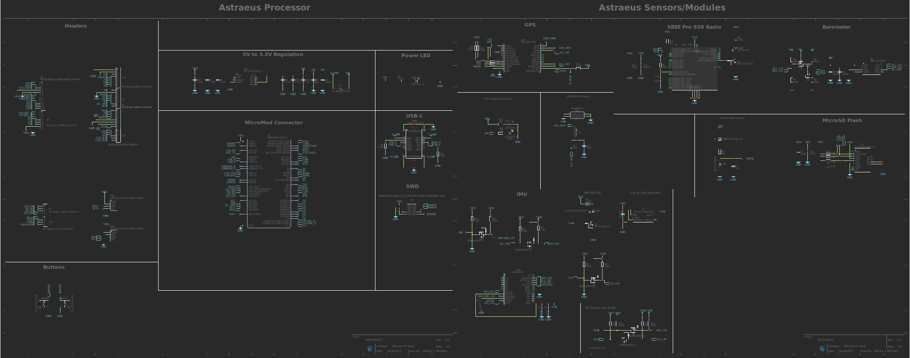
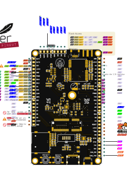

# Astraeus-I Schematic and Board Layout

Welcome to the Astraeus-I repository. This project encompasses the intricate design details of the Astraeus-I.

## Repository Structure:
- [**schem**](./schem): This folder contains the schematic files detailing the electronic circuit diagram of Astraeus-I.
- [**board**](./board): Here you'll find the PCB (Printed Circuit Board) layout files for the physical component arrangements of Astraeus-I.

### Schematic (SVG)

### Board Pinout (SVG)

    

    
For any additional details or clarifications, please explore the respective folders.

    
For the organization and firmware related to Astraeus-I, please visit <a href="https://github.com/Astraeus-I">this link</a>.

